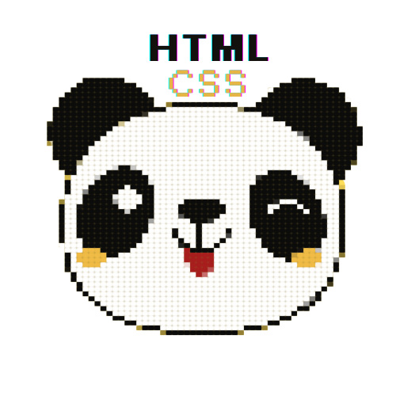

<a name="readme-top">

<br/>

<br />
<div align="center">
  <a href="https://github.com/zyx-0314/">
    
  </a>
  <h3 align="center">Personal Website</h3>
</div>
<div align="center">
 This project is a personal website that showcases my design skills and web development knowledge. The website has 5 pages, including all the past projects I have worked on. It will serve as a portfolio that allows you to learn more about me.
</div>

<br />


---

<br />
<br />

<!-- TODO: If you want to add more layers for your readme -->
<details>
  <summary>Table of Contents</summary>
  <ol>
    <li>
      <a href="#overview">Overview</a>
      <ol>
        <li>
          <a href="#key-components">Key Components</a>
        </li>
        <li>
          <a href="#technology">Technology</a>
        </li>
      </ol>
    </li>
    <li>
      <a href="#rule,-practices-and-principles">Rules, Practices and Principles</a>
    </li>
    <li>
      <a href="#resources">Resources</a>
    </li>
  </ol>
</details>

---

## Overview

<!-- TODO: To be changed -->
<!-- The following are just sample -->

Description of the project in details.

Guiding Question:

- What is the project
  This project builds a personal website that demonstrates design skills and web development knowledge. The website include 5 pages, showcasing distinct layouts for various features. It will serve as a portfolio showcasing your skills and past projects.
- Whats the purpose
  The purpose of this project was to show and apply all the knowledge we learned in this subject and create a creative and visual portfolio,demonstrating our proficiency in HTML and CSS..
- What are key components
- What technology used and how it is used

### Key Components

<!-- TODO: List of Key Components -->
<!-- The following are just sample -->

- MultiPage Website
- Animated Cards
- Hover Effects
- Interactive Elements
- Interactive Features

### Technology

<!-- TODO: List of Technology Used -->


## Rules, Practices and Principles

1. Always use `WD-` in the front of the Title of the Project for the Subject followed by your custom naming.
2. Do not rename any .html files; always use `index.html` as the filename.
3. Place Files in their respective folders.
4. All file naming are in camel case.
   - Camel case is naming format where there is no white space in separation of each words, the first word is in all lower case while the succeding words first letter are in upper followed by lower cased letters.
   - ex.: buttonAnimatedStyle.css
5. Use only `External CSS`.
6. Renaming of Pages folder names are a must, and relates to what it is doing or data it holding.
7. File Structure to follow below.

```
WD-ProjectName
└─ assets
|   └─ css
|   |   └─ style.css
|   └─ img
|   |   └─ fileWith.jpeg/.jpg/.webp/.png
|   └─ js
|       └─ script.js
└─ pages
|  └─ pageName
|     └─ assets
|     |  └─ css
|     |  |  └─ style.css
|     |  └─ img
|     |  |  └─ fileWith.jpeg/.jpg/.webp/.png
|     |  └─ js
|     |     └─ script.js
|     └─ index.html
└─ index.html
└─ readme.md
```

## Resources

<!-- TODO: Add References -->

| Title       | Purpose                                                     | Link                                                 |
| ----------- | ----------------------------------------------------------- | ---------------------------------------------------- |
| Youtube     | Get some ideas about design and styling the a landing page. | https://youtu.be/zJE-ze4TfXc?si=l35XdIjwss02WwcZ     |
| GoogleFont  | Use some Fonts like poppins and cursive font style.         | https://fonts.googlecom/                             |
| AwesomeFont | Use some icons for social media and footer.                 | https://fontawesome.com/icons/user?f=classic&s=solid |
| Github      | Get the links from my previous projects.                    | https://github.com/Maerona03                         |
